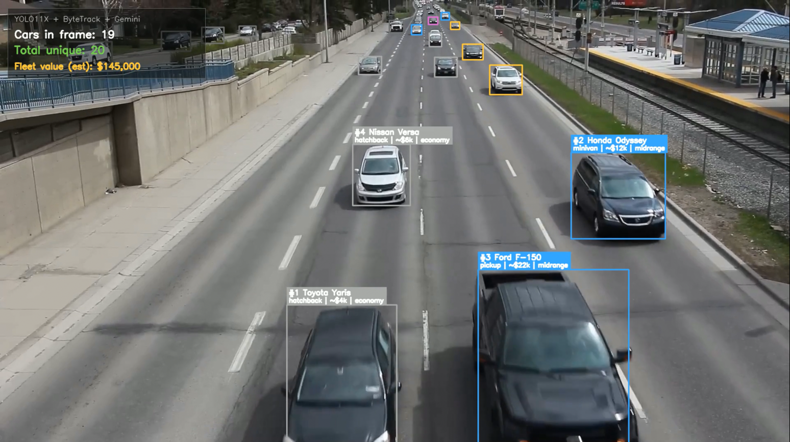

# Nexus

> Cross-channel media measurement — out-of-home vision, broadcast audio
> fingerprinting, and telecom signals unified into one live dashboard.

<p align="center">
  
  <br/>
  <sub><i>Vehicle profiling pipeline: YOLOv11x + ByteTrack + Gemini Flash Lite.</i></sub>
</p>

## Modules

| Path | What it does |
|---|---|
| [`backend/`](backend) | FastAPI service — `/api/match`, `/api/tracks`, `/api/metrics`, `/api/telecom`, SSE event stream |
| [`core/`](core) | Pure-Python DSP — STFT → constellation hashes → coherence-scored matcher |
| [`frontend/`](frontend) | Next.js app (landing · demo · live dashboard) |
| [`mobile/`](mobile) | Companion mobile app |
| [`scripts/`](scripts) | CLI tools — build the fingerprint DB, evaluation, synthetic tests |
| [`data/`](data) | Reference audio, fingerprint DB, telecom sector config |
| [`pi_vehicle_detection/`](pi_vehicle_detection) | Edge live vehicle counter (Raspberry Pi + MobileNet-SSD, ~3–10 FPS) |
| [`vehicle_profiling/`](vehicle_profiling) | Offline pipeline: YOLOv11 + ByteTrack + Gemini for car make/model/segment/price annotation |
| [`docs/`](docs) | Architecture diagrams |

## Quick start

```bash
pip install -r backend/requirements.txt
python scripts/generate_fingerprints.py        # build the DB once
uvicorn backend.app.main:app --reload --port 8000
```

Then open:

- <http://localhost:8000/> — landing page
- <http://localhost:8000/demo.html> — vision + audio demo
- <http://localhost:8000/dashboard.html> — live dashboard
- <http://localhost:8000/docs> — auto-generated OpenAPI

## Audio fingerprinting

The browser captures 2 s of mic audio and computes ~2 k constellation
hashes locally (`NexusFingerprint.compute()`), POSTs them to
`/api/match`. The backend picks the track with the largest coherent
time-offset cluster (Shazam-style scoring), publishes the result on the
SSE channel, and returns a synchronous match + confidence.

**Latest evaluation:** 88 % top-1 · 100 % recall · 4.6 × coherence gap
between real matches and noise probes.

```bash
# Add a track at runtime — same DSP as the offline build path
curl -F "file=@my_ad.wav" -F "name=My Ad" -F "brand=Acme" \
     http://localhost:8000/api/tracks

# Run the full evaluation suite
python scripts/evaluate.py
```

## Telecom macro density

Computes audience density from cellular sector telemetry (capacity %,
C/I dB, calibration), maps billboards to weighted sector blends, and
publishes the resulting density values via REST + SSE.

```
D = (0.65 · cap_norm + 0.35 · (1 − ci_norm)) · calibration
```

```bash
# Ingest live telemetry
curl -X POST http://localhost:8000/api/telecom/ingest \
  -H "Content-Type: application/json" \
  -d '{"timestamp":1714550400,"sectors":[
        {"sector_id":"tunis_a","name":"Tunis A",
         "capacity_used_pct":87.5,"ci_db":12.4,"calibration":1.05}
      ]}'

# Query densities
curl http://localhost:8000/api/telecom/macro | jq .
```

Status lifecycle: `static_config` → `live` (first ingest) → `stale`
(no update for `TELECOM_STALE_TTL_SEC` = 45 s). Tunables live in
[`backend/app/config.py`](backend/app/config.py).

## Vision pipelines

### Edge — live vehicle counter

[`pi_vehicle_detection/`](pi_vehicle_detection) runs a MobileNet-SSD on
a Raspberry Pi camera feed at ~3–10 FPS. Setup, model download, and
controls are documented in
[`pi_vehicle_detection/README.md`](pi_vehicle_detection/README.md).

### Offline — make/model/segment profiling

[`vehicle_profiling/`](vehicle_profiling) detects and tracks every
unique vehicle with **YOLOv11x + ByteTrack**, picks the best crop per
track ID, and asks **Gemini Flash Lite** to identify *make · model ·
body-type · era · segment · ballpark USD price*. Output: an annotated
mp4 with boxes coloured by market segment (luxury / premium / midrange
/ economy) and a running fleet-value HUD.

```bash
GEMINI_API_KEY=…  python vehicle_profiling/profile_cars.py \
    --input  vehicle_profiling/assets/cars.mp4 \
    --output vehicle_profiling/assets/cars_profiled.mp4 \
    --device cpu
```

Multiple comma-separated keys in `GEMINI_API_KEY` are rotated
automatically on rate-limit. Sample outputs and trims live in
[`vehicle_profiling/assets/`](vehicle_profiling/assets/).

## Architecture

Full diagram: [`docs/Nexus_Architecture.pdf`](docs/Nexus_Architecture.pdf).

```
┌──────────── frontend/ ─────────────┐
│  index.html · demo.html · dashboard│
└─────────────────┬──────────────────┘
                  │ /api/match · /api/tracks · /api/metrics
                  │ /api/telecom · /api/events (SSE)
┌─────────────────▼──────────────────┐
│ backend/app/   FastAPI + CORS + SSE│
│   api/   db/store   services/      │
└─────────────────┬──────────────────┘
                  │
┌─────────────────▼──────────────────┐
│ core/    STFT → hashes → matcher   │
└─────────────────┬──────────────────┘
                  │
┌─────────────────▼──────────────────┐
│ scripts/  data/   CLI + fixtures   │
└────────────────────────────────────┘
```

## Scaling notes

`core.matcher.HashIndex` is `dict[hash → list[(track_id, time)]]`. For
&gt; 1 M hashes, swap the in-memory dict for Redis (one `HSET` per
hash) or Postgres with a btree on `hash` — `db.store.FingerprintStore`
is the only adapter the API and DSP layers see, so the change is local.
At high QPS, move the SSE broker to Redis pub/sub and run uvicorn with
`--workers > 1`.
